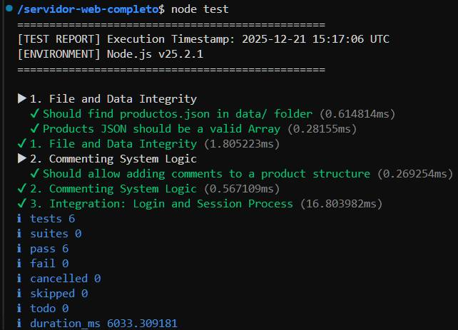

Extended Web Server Project
A high-performance Node.js web server featuring session authentication, file management, and server-side monitoring.

#### Features
- Authentication: Session-based login with HttpOnly cookies.
- File Upload: Image upload system for product management.
- Comments: Product commenting system with JSON persistence.
- Caching: API response caching to reduce disk I/O.
- Metrics: Real-time server performance monitoring (response latency).
- Testing: Automated test suite using the Node.js Native Test Runner.

### Technology Stack
- Runtime: Node.js (v20+)
- Testing Framework: node:test (Native)
- Persistence: JSON File System
- Architecture: Custom Template Engine (Vanilla JS)

### Installation & Usage
- Start the server:

Bash | Linux
$ npm start

Run tests: (Ensure the server is running in another terminal)

Bash | Linux

$ npm test

### Testing Coverage
The test suite validates:
- Data Integrity: JSON structure and file availability.
- Business Logic: Commenting system functionality.
- Integration: Real HTTP authentication and session issuance.

### Test Execution Evidence:
